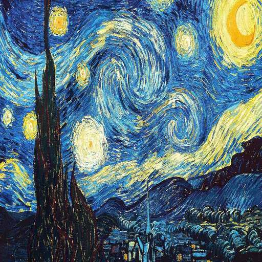

# Neural Style Transfer - what it's all about

Neural Style Transfer is a very neat and catchy technique to generate novel artistic images by transferring the styles of one or more images on a content image. This technique was introduced by [Gatys et al.](https://arxiv.org/abs/1508.06576) and since has been further enhanced and improved upon via different optimization algorithms, regularization techniques and image processing variations. 
 

## Single Style Transfer 

Single style transfer is the technique of transferring the style aspects of one image on a content image to generate an artistic style transferred content image. This is the fundamental technique for style transfer which has been implemented as a tutorial in the [official PyTorch GitHub repository](https://github.com/pytorch/tutorials/blob/master/advanced_source/neural_style_tutorial.py) with some amazing explanation of the flow [right here with a note on optimization by Mr Gatys himself] (https://pytorch.org/tutorials/advanced/neural_style_tutorial.html)

I have used that notebook as reference and cleaned up the order of execution of cells by creating all classes and method definitions at the top and calling them all at once by passing them as parameters to the algorithm. Here are some instances of how a single style transfer works-

 
 

## Multi Style Transfer

Multi style transfer os the technique of transferring the styles of two or more images on a content image, blend them with the content image to generate different artistic styles. In this repository, I have extended the Style Transfer with 1 image and added the ability to process 2 style images, easily scalable to multiple images. I've used PyTorch with complete implementation in the notebook itself.

Some instances of Multi-Style transfer at play - 